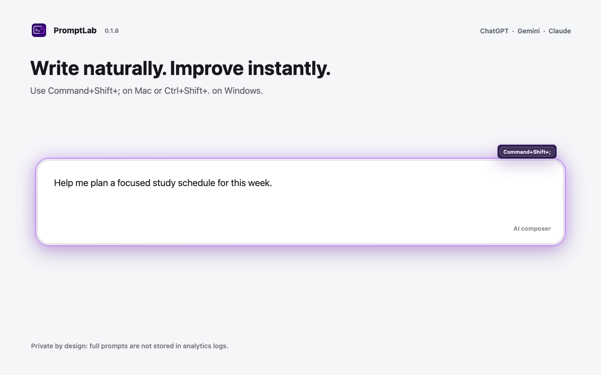
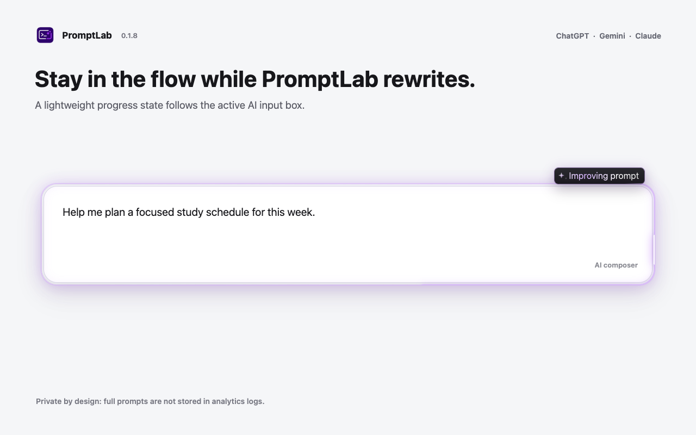
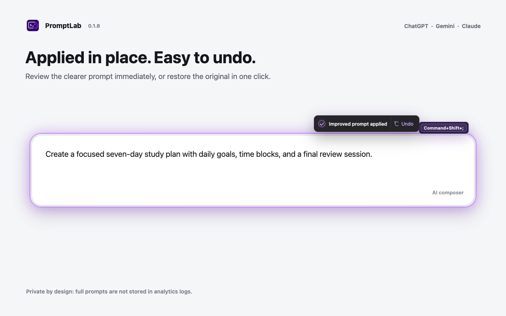
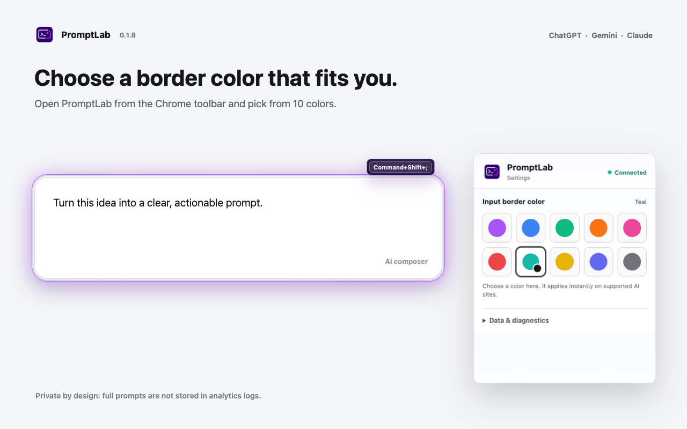

# PromptLab Extension

PromptLab은 ChatGPT, Gemini, Claude의 입력창에서 프롬프트를 더 명확하고 실행 가능한 형태로 개선하는 Chrome 확장 프로그램입니다. 별도 편집기를 열지 않고 단축키로 개선하며, 결과는 기존 입력창에 바로 적용됩니다.

## 주요 기능

- ChatGPT, Gemini, Claude 입력창에서 바로 프롬프트 개선
- 원문의 의도와 범위를 유지하면서 명확성, 맥락, 형식, 제약 조건 보완
- 개선 완료 후 한 번의 클릭으로 원본 프롬프트 복원
- 긴 프롬프트와 첨부 이미지에도 맞춰지는 반응형 입력창 테두리
- 10가지 입력창 테두리 색상
- 한국어 및 영어 UI






## 사용 방법

1. ChatGPT, Gemini 또는 Claude를 엽니다.
2. AI 입력창에 프롬프트를 작성합니다.
3. macOS에서는 `Command+Shift+;`, Windows/Linux에서는 `Ctrl+Shift+.`를 누릅니다.
4. 입력창에 적용된 개선본을 확인합니다.
5. 원본이 필요하면 `되돌리기`를 선택합니다.

## 테두리 색상 변경

1. Chrome 도구 모음에서 PromptLab 아이콘을 선택합니다.
2. `입력창 테두리 색상`에서 원하는 색상을 선택합니다.
3. 열려 있는 AI 페이지로 돌아가면 선택한 색상이 자동으로 적용됩니다.

## 데이터 처리

프롬프트 개선을 위해 입력한 프롬프트가 PromptLab 백엔드로 전송되며, 백엔드는 개선본 생성을 위해 OpenAI API를 사용할 수 있습니다. PromptLab 분석 로그에는 원본 프롬프트 전문이나 개선된 프롬프트 전문을 저장하지 않습니다.

로그는 익명 사용자 ID, 세션 ID, 대상 AI 플랫폼, 개선 메타데이터, 프롬프트 해시, 글자 수 등 제한적인 익명 메타데이터만 저장합니다. 동일한 `user_id`와 `session_id`가 다시 전송되면 새 행을 추가하지 않고 기존 세션 로그를 업데이트합니다.

자세한 내용은 [PRIVACY.md](./PRIVACY.md)를 참고하세요.

## 동작 환경

- 지원 사이트: `https://chatgpt.com/*`, `https://chat.openai.com/*`, `https://gemini.google.com/*`, `https://claude.ai/*`
- 백엔드 API: `https://promptlab-server.onrender.com`
- OpenAI API 호출은 확장 프로그램이 아니라 백엔드 서버에서 수행됩니다.

## 개발자 참고

로컬 서버 실행:

```bash
cd server
npm install
npm run dev
```

로컬 서버 기본 주소는 `http://localhost:3000`입니다. Supabase 환경 변수가 없으면 로그는 `server/logs/prompt_sessions.json`에 저장됩니다.

주요 환경 변수:

- `OPENAI_API_KEY`: OpenAI API 키
- `OPENAI_REWRITE_MODEL` 또는 `OPENAI_PROMPT_MODEL`: 프롬프트 개선 모델 (기본값: `gpt-5.6-luna`)
- `OPENAI_MAX_COMPLETION_TOKENS`: 프롬프트 개선 응답 토큰 상한
- `OPENAI_REASONING_EFFORT`: reasoning 모델의 개선 호출 effort
- `SUPABASE_URL`, `SUPABASE_SERVICE_ROLE_KEY`: Supabase 로그 저장 설정

주요 API:

- `GET /health`: 서버 상태 확인
- `POST /api/improve`: 프롬프트 개선
- `POST /api/log`: 익명 세션 메타데이터 저장 또는 업데이트
- `GET /api/logs/export/json`: 로그를 JSON으로 내보내기
- `GET /api/logs/export/csv`: 로그를 CSV로 내보내기

## 라이선스

이 프로젝트는 [MIT License](./LICENSE)로 배포됩니다.

---

# PromptLab Extension

PromptLab is a Chrome extension that turns prompts into clearer, more actionable instructions directly inside the ChatGPT, Gemini, and Claude input boxes. It works with a keyboard shortcut and applies the result in place without opening a separate editor.

## Key Features

- Improves prompts directly in ChatGPT, Gemini, and Claude
- Preserves the original intent while improving clarity, context, format, and constraints
- Restores the original prompt with one-click Undo
- Uses a responsive input border for long prompts and attachments
- Offers 10 customizable input border colors
- Supports Korean and English interfaces

## How To Use

1. Open ChatGPT, Gemini, or Claude.
2. Write a prompt in the AI input box.
3. Press `Command+Shift+;` on macOS or `Ctrl+Shift+.` on Windows/Linux.
4. Review the improved prompt applied in the input box.
5. Select `Undo` when you need the original prompt.

## Change The Border Color

1. Select the PromptLab icon in the Chrome toolbar.
2. Choose a color under `Input border color`.
3. Return to the AI tab. The selected color is applied automatically.

## Data Handling

Prompt text is sent to the PromptLab backend to provide the improvement feature. The backend may use the OpenAI API to generate the improved prompt. PromptLab analytics logs do not store the full original prompt or the full improved prompt.

Stored analytics are limited to anonymous metadata such as an anonymous user ID, session ID, target AI platform, improvement metadata, prompt hashes, and character lengths. When the same `user_id` and `session_id` are received again, the existing session log is updated instead of creating another row.

See [PRIVACY.md](./PRIVACY.md) for details.

## Runtime Environment

- Supported sites: `https://chatgpt.com/*`, `https://chat.openai.com/*`, `https://gemini.google.com/*`, `https://claude.ai/*`
- Backend API: `https://promptlab-server.onrender.com`
- OpenAI API calls are made by the backend server, not by the extension.

## Developer Notes

Run the local server:

```bash
cd server
npm install
npm run dev
```

The local server defaults to `http://localhost:3000`. If Supabase environment variables are not configured, logs are written to `server/logs/prompt_sessions.json`.

Main APIs:

- `GET /health`: Check server status
- `POST /api/improve`: Improve a prompt
- `POST /api/log`: Store or update anonymous session metadata
- `GET /api/logs/export/json`: Export logs as JSON
- `GET /api/logs/export/csv`: Export logs as CSV

## License

This project is distributed under the [MIT License](./LICENSE).
