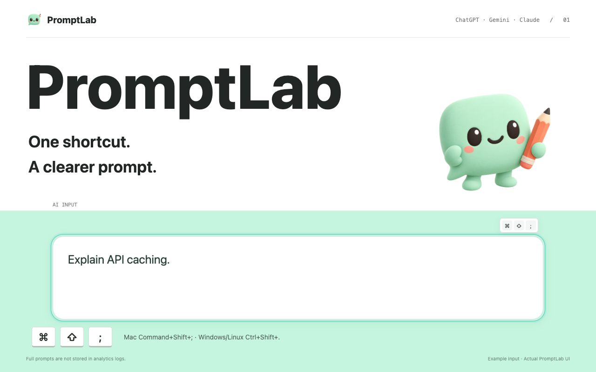
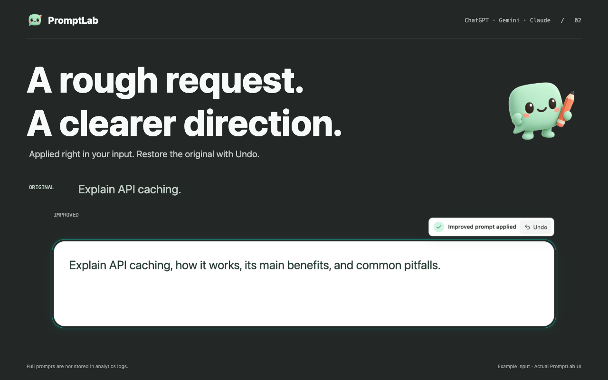
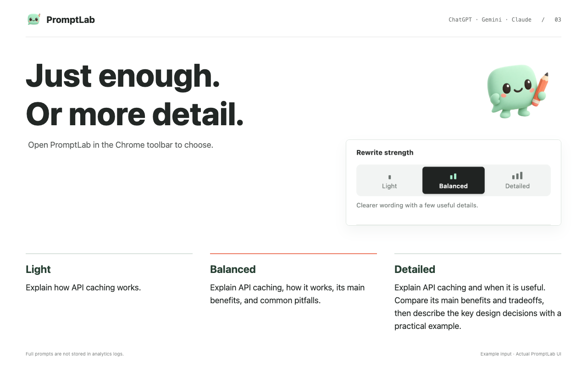
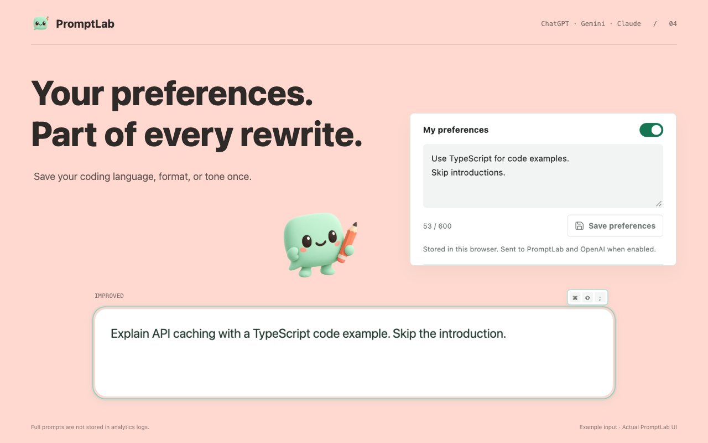
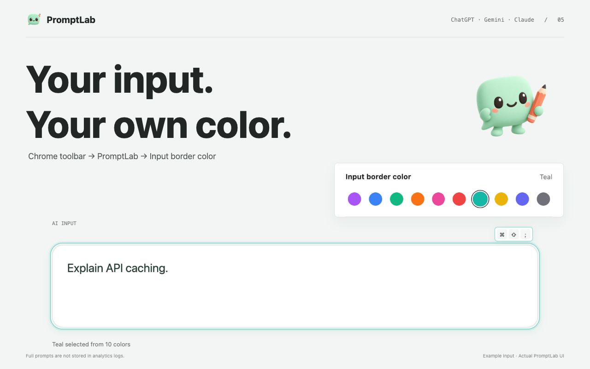

# PromptLab Extension

**쓰던 AI 입력창에서, 단축키 한 번으로 더 명확한 프롬프트를.**

ChatGPT·Gemini·Claude의 입력창 안에서 프롬프트를 개선하고 바로 적용하는 Chrome 확장 프로그램입니다. 별도 편집기로 복사할 필요 없이, 결과를 확인하고 원문으로 되돌릴 수 있습니다.

[Chrome 웹 스토어](https://chromewebstore.google.com/detail/promptlab-extension/cccaddmgliiiepjcgaekieijbidlpljg) · [소개 & 개발 저널](https://jinhyeong-studio.jinhyeong9568-663.workers.dev/projects/promptlab-extension) · [개인정보 처리](PRIVACY.md)



## 사용 흐름

1. ChatGPT, Gemini 또는 Claude에 프롬프트를 씁니다.
2. **macOS: ⌘ ⇧ ; / Windows·Linux: Ctrl ⇧ .** 를 누릅니다.
3. 같은 입력창에 적용된 개선본을 확인합니다. 필요하면 **되돌리기**로 원문을 복원합니다.

## 주요 기능

- 가볍게 / 균형 / 자세히, 3단계 개선 강도 선택
- 최대 600자의 기본 조건 저장과 적용 스위치

- 입력창에서 바로 개선하고 원문으로 되돌리는 짧은 작업 흐름
- 의도와 범위를 유지하며 표현·맥락·형식·제약 조건 보완
- 긴 입력과 첨부 이미지에 맞춰지는 테두리·진행 표시
- 10가지 테두리 색상, 한국어·영어 인터페이스

### 개선 강도와 내 기본 조건

`main`의 확장 프로그램 버전은 **0.1.9**입니다. 가벼운 표현 수정부터 관련 구조·기준 구체화까지 강도를 고를 수 있으며, 기본값은 **균형**입니다. 스토어 배포 버전은 별도로 확인하세요.

기본 조건은 브라우저에 저장하고 적용을 켰을 때만 개선 요청에 함께 전달합니다. 원문에 명시한 조건이 우선하며, 스위치를 꺼도 저장한 내용은 유지됩니다. 단순한 요청까지 장황하게 바꾸거나 사용자의 상황을 과하게 추정하지 않도록 개선하고 있습니다.

## 구현

```text
AI 사이트 입력창
  → Content Script · 단축키 / 상태 표시 / 적용 / Undo
  → Node.js + Express API
  → OpenAI · 개선본 생성
  → 입력창에 결과 반영
```

분석용 세션 메타데이터는 Supabase 또는 로컬 JSON에 저장합니다. 모델 API 키는 확장 프로그램이 아니라 **서버 환경 변수**로 관리합니다.

## 로컬 개발

```bash
cd server
npm install
# server/.env.example을 참고해 서버 환경 변수 설정
npm run dev
```

기본 서버 주소는 `http://localhost:3000`입니다. Chrome의 확장 프로그램 개발자 모드에서 `extension/`을 로드합니다. 로컬 API로 테스트하려면 Content Script의 서버 주소도 로컬 주소에 맞춥니다.

| 설정 | 용도 |
| --- | --- |
| `OPENAI_API_KEY` | 서버의 모델 API 호출 |
| `OPENAI_REWRITE_MODEL` / `OPENAI_PROMPT_MODEL` | 프롬프트 개선 모델 선택 |
| `OPENAI_MAX_COMPLETION_TOKENS` | 응답 토큰 상한 |
| `OPENAI_REASONING_EFFORT` | 지원 모델의 추론 수준 |
| `SUPABASE_URL`, `SUPABASE_SERVICE_ROLE_KEY` | 선택적 세션 로그 저장 |

설정 원본: [server/.env.example](server/.env.example)

## 데이터 처리

개선할 프롬프트는 PromptLab 백엔드와 OpenAI API에 전달됩니다. **모든 처리가 기기 안에서 끝나는 도구는 아닙니다.**

분석 로그에는 프롬프트 전문 대신 익명 사용자·세션 ID, 플랫폼, 해시, 글자 수 등의 메타데이터를 저장합니다. 상세 범위와 처리 방식은 [PRIVACY.md](PRIVACY.md)를 확인하세요.

<details>
<summary>화면 더 보기</summary>






</details>

**개발:** 정진형 · **License:** [MIT](LICENSE)
